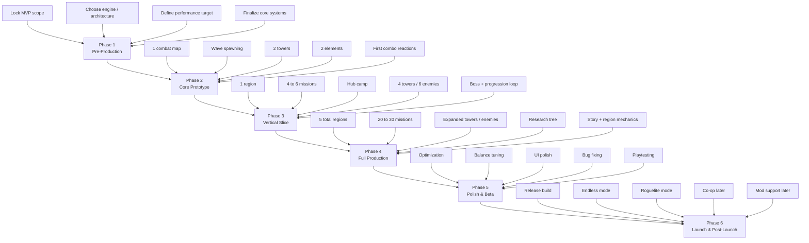
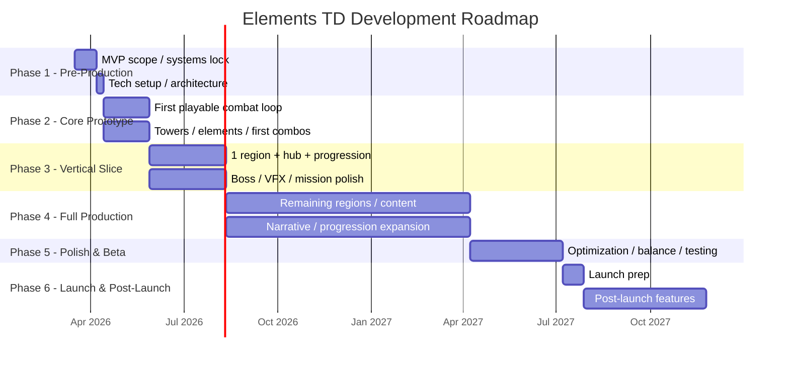
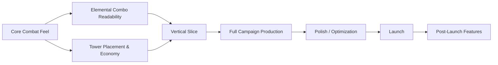

# Elements TD — Roadmap Visualization

Below are two visualizations of the roadmap: a phase flow diagram and a milestone timeline.

## 1) Roadmap Phase Flow

## 2) Milestone Timeline

## 3) Simplified Dependency View

## Notes
- The most important milestone is the **Core Prototype**. If the game is not fun there, later content will not save it.
- The **Vertical Slice** should prove the game can carry a full campaign.
- **Post-launch features** like co-op, modular towers, and mod support should stay out of MVP unless development moves unusually fast.
